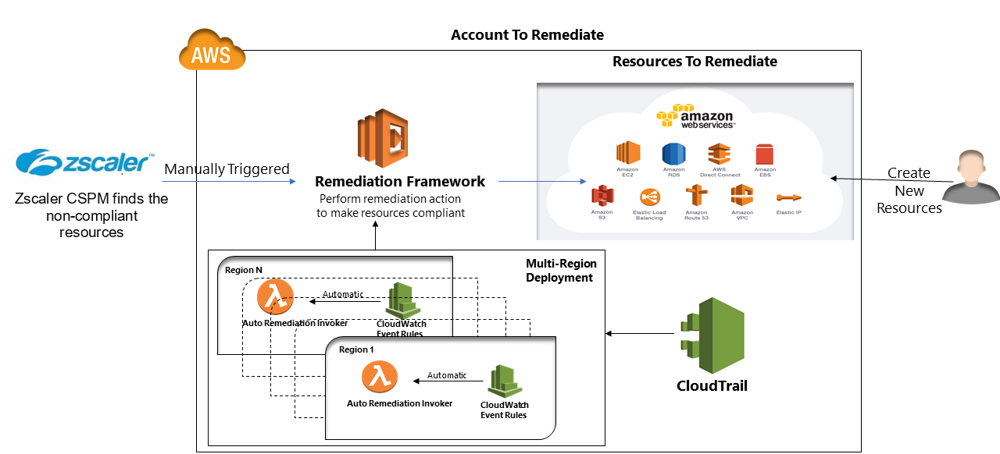

**AWS Remediation**
-------------------

## Solution Overview

This remediation solution is designed to continuously perform remediation in near real-time of non-compliant AWS resources. It helps to set up security configurations whenever new resources get created in AWS account. Along with Cloudneeti solution helps you to remediate existing non-compliant resources.

### How it works

The remediation framework uses Cloudwatch event rules, CloudTrail, CloudWatch log group, the remediation lambda functions, and the appropriate IAM roles.

1. AWS account administrator creates/updates/reconfigure resources in aws account
2. CloudTrail and CloudWatch event bus collects the events occurred in AWS account and trigger appropriate event rule.
3. CloudWatch event rule trigger the auto-remediation invoker in near real-time in its region
4. Form different aws region Auto-remediation-invoker lambda calls the orchestrator which then call appropriate remediation functions present in the remediation framework 
5. Remediation functions setup required security configuration on the resources

This auto-remediation solution supports multi-account remediation as well. Here, we are providing cross-account access roles to execute the remediation functions present in remediation framework account.

Use Cloudneeti to configure remediation policies on the AWS account. You can manually trigger remediation of existing resources from Cloudneeti portal. Remediation framework always remediates resources whenever somebody creates new resources or updates the existing resources. 

## Pre-requisites

Following dependencies should be present on the machine before proceeding to onboarding steps,

-  AWS Command Line Interface (CLI) is a unified tool to manage your AWS services 

	Install AWS CLI following steps present [here](https://docs.aws.amazon.com/cli/latest/userguide/cli-chap-install.html)

- Nodejs

	Download the latest stable version of Nodejs from [here](https://nodejs.org/en/download) and install it on the workstation.

- Serverless CLI tool to manage AWS deployments

	Execute the below command to install a serverless module,

	`# npm install –g serverless`

- JQ for bash terminal

	`https://stedolan.github.io/jq/download/`

- ZCSPM AWS Account Id

	You can retrieve this from the ZCSPM Welcome email, else you can contact ZCSPM support.

## Onboarding Steps

Follow the below steps to set up remediation procedures

1. Download and Unzip latest package from the link below.

	`https://github.com/Cloudneeti/aws-auto-remediation/releases`

3. Change to remediation directory

	`# cd aws-auto-remediation`

3. Configure AWS account using below command

	 `# aws configure`

   Enter the required inputs:
   - AWS Access Key ID: Access key of any admin user of the account in consideration.
   - AWS Secret Access Key: Secret Access Key of any admin user of the account in consideration
   - Default region name: AWS region name (eg: us-east-1)
   - Default output format: json

### Provision Remediation Framework
Perform below steps to deploy remediation framework on configured AWS account
1. Open bash terminal
2. Deploy remediation framework in selected regions or in all regions

	Note: Primary region for multi account deployment should be the same as that of the remediation framework primary region for single account deployment

	`# bash deploy-remediation-framework.sh -a <12-digit-account-id> -z <12-digit-zcspm-account-id> -p <primary-deployment-region> -e <environment-prefix> -v <version> -s <list of regions where auto-remediation is to be enabled>`

	OR

	`# bash deploy-remediation-framework.sh -a <12-digit-account-id> -z <12-digit-zcspm-account-id> -p <primary-deployment-region> -e <environment-prefix> -v <version> -s <all>`

	Pass AWS account id and the environment as dev/test/prod.

3. Verify remediation framework setup

	`# bash verify-remediation-setup.sh -a <12-digit-account-id> -p <primary-deployment-region> -e <environment-prefix> -s <list of regions where auto-remediation is to be verified>`

	OR

	`# bash verify-remediation-setup.sh -a <12-digit-account-id> -p <primary-deployment-region> -e <environment-prefix> -s <all>`

### Configure Multi-Account Remediation

In case you want to use same remediation framework for remediation of multiple AWS accounts then perform the below steps to configure multi-account remediation setup,

1. Deploy remediation framework as given in above steps
2. Update role on AWS account where remediation framework is present

	`# bash update-remediation-role.sh -a <12-digit-account-id> -r <remediation-framework-account-id>`

   This command will update the invocation role associated with the cross-account present in remediation framework.

3. Configure AWS account on account to be remediated

	`# aws configure`

   Enter the required inputs:
   - AWS Access Key ID: Access key of any admin user of the account in consideration.
   - AWS Secret Access Key: Secret Access Key of any admin user of the account in consideration
   - Default region name: AWS region name (eg: us-east-1)
   - Default output format: json

4. Switch to `multi-mode-remediation` directory

	`# cd multi-mode-remediation`
5. Configure multi-account remediation using below commands to deploy in specific or all regions
	
	Note: Primary region for multi account deployment should be the same as that of the remediation framework primary region for single account deployment

	`# bash configure-multi-mode-remediation.sh -a <12-digit-account-id> -r <12-digit-account-id> -p <primary-deployment-region> -e <environment-prefix> -v <version> -s <list of regions where auto-remediation is to enabled>`

	OR

	`# bash configure-multi-mode-remediation.sh -a <12-digit-account-id> -r <12-digit-account-id> -p <primary-deployment-region> -e <environment-prefix> -v <version> -s <all>`

   This command creates the required resources like Cloudtrail, Cloudwatch event rules, Remediation functions and roles required to perform cross-account remediation 
6. Verify multi-account remediation setup

	`# bash verify-multi-mode-remediation-setup.sh -a <12-digit-account-id> -r <12-digit-account-id> -p <primary-deployment-region> -e <environment-prefix> -s <list of regions where auto-remediation is to be verified>`

	OR

	`# bash verify-multi-mode-remediation-setup.sh -a <12-digit-account-id> -r <12-digit-account-id> -p <primary-deployment-region> -e <environment-prefix> -s <all>`

## Configure remediation on Cloudneeti Account

On Cloudneeti you need to have AWS account on-boarded. 

### Configure Account Remediation
1. Login to Cloudneeti portal
2. Go to settings and click on “Configure Account Remediation”
3. Change Remediation State to enable and enter AWS account id in which remediation framework deployed using earlier steps.

   

### Enable Remediation Policies
After configuring remediation settings, enable the remediation policies on Cloudneeti portal.

Refer, [Cloudneeti docs](https://docs.cloudneeti.com) to perform remediation of existing resources. 

## Remediation Policies Supported
Refer [here](remediation-policies.md) for available remediation policies.

## FAQ

## Disclaimer

Copyright (c) Cloudneeti - All rights reserved.

Permission is hereby granted, free of charge, to any person obtaining a copy of this software and associated documentation files (the "Software"), to deal in the Software without restriction, including without limitation the rights to use, copy, modify, merge, publish, distribute, sublicense, and/or sell copies of the Software, and to permit persons to whom the Software is furnished to do so, subject to the following conditions: The above copyright notice and this permission notice shall be included in all copies or substantial portions of the Software. THE SOFTWARE IS PROVIDED "AS IS", WITHOUT WARRANTY OF ANY KIND, EXPRESS OR IMPLIED, INCLUDING BUT NOT LIMITED TO THE WARRANTIES OF MERCHANTABILITY, FITNESS FOR A PARTICULAR PURPOSE AND ONINFRINGEMENT. IN NO EVENT SHALL THE AUTHORS OR COPYRIGHT HOLDERS BE LIABLE FOR ANY CLAIM, DAMAGES OR OTHER LIABILITY, WHETHER IN AN ACTION OF CONTRACT, TORT OR OTHERWISE, ARISING FROM, OUT OF OR IN CONNECTION WITH THE SOFTWARE OR THE USE OR OTHER DEALINGS IN THE SOFTWARE.